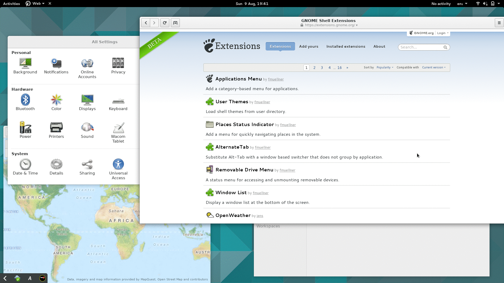

# Switcher

Switcher is a [Gnome Shell extension](https://extensions.gnome.org) for quickly
switching windows by typing.



### Installation

Download from https://extensions.gnome.org/extension/foo/bar/not-yet-there or
checkout to the correct place as

```
cd ~/.local/share/gnome-shell/extensions
git clone git@github.com:daniellandau/switcher.git switcher@landau.fi
```

You can then enable the extension with Gnome Tweak Tool.

### How to use

Use the configured hot key (<Super>w by default) to open the switcher and start
typing a part of the name or current title of the window you want. Hit the Esc
key to cancel and the Return key to activate the window at the top of the list.


## Contributing

Contributions are welcome and I will try my best to answer quickly to all
suggestions. If you start working on something mentioned in [TODO.md], let me
know so I don't scoop you.

## License

This program is free software: you can redistribute it and/or modify it under
the terms of the GNU General Public License as published by the Free Software
Foundation, either version 3 of the License, or (at your option) any later
version.

## Aknowledgements

As there is no really good central place to find documentation on writing Gnome
Shell Extensions I'll list here where I got information from.

* The source code of [Project Hamster Extension](https://github.com/projecthamster/shell-extension)
* The source code of [Window List Extension](http://git.gnome.org/gnome-shell-extensions)
* The source code of [Gnome Shell itself](https://git.gnome.org/browse/gnome-shell/) (especially the file js/ui/switcherPopup.js)
* The documentation listed in this [Stackoverflow answer](stackoverflow.com/questions/13107743/documentation-for-writing-gnome-shell-extensions)
* The [Shell Toolkit documentation](https://developer.gnome.org/st/stable/),
  which is written for the C library, but can be used for JS too, using e.g.
  `new St.Label()` to make a an StLabel.

I thank my employer [Futurice](https://github.com/futurice/) for providing
monetary sponsorship for this work through the
[Spice Program](http://spiceprogram.org/oss-sponsorship/)
